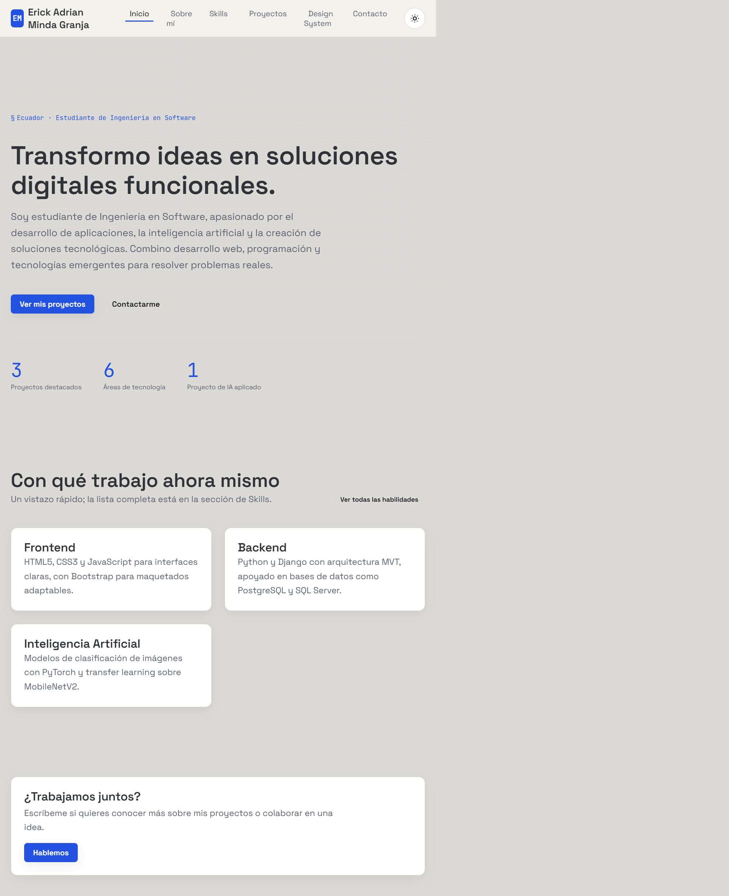
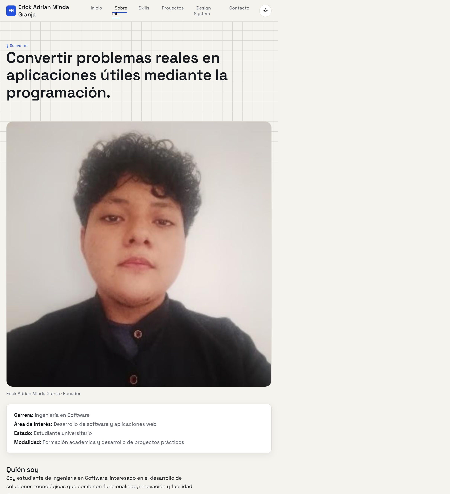
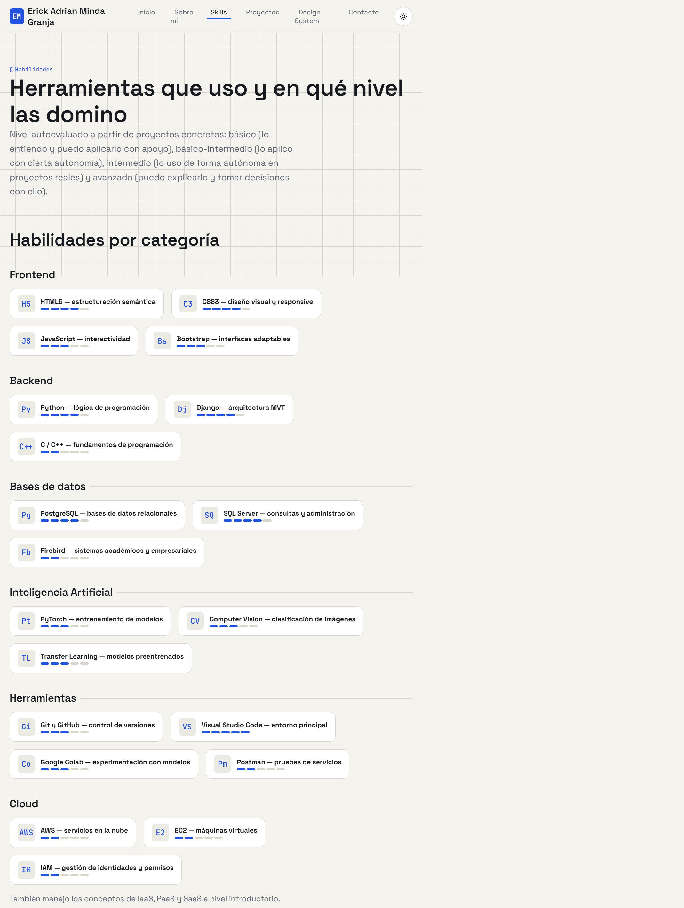
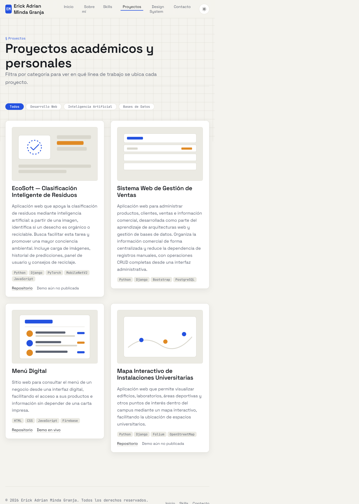
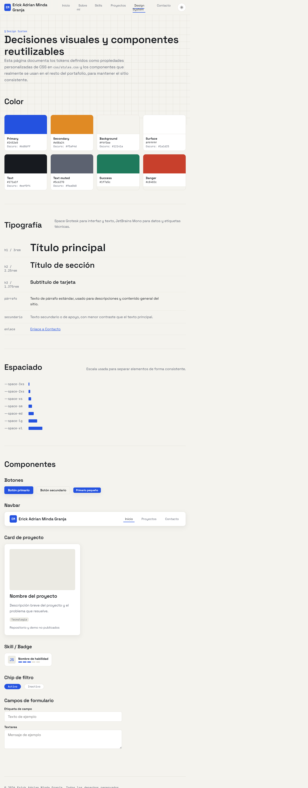
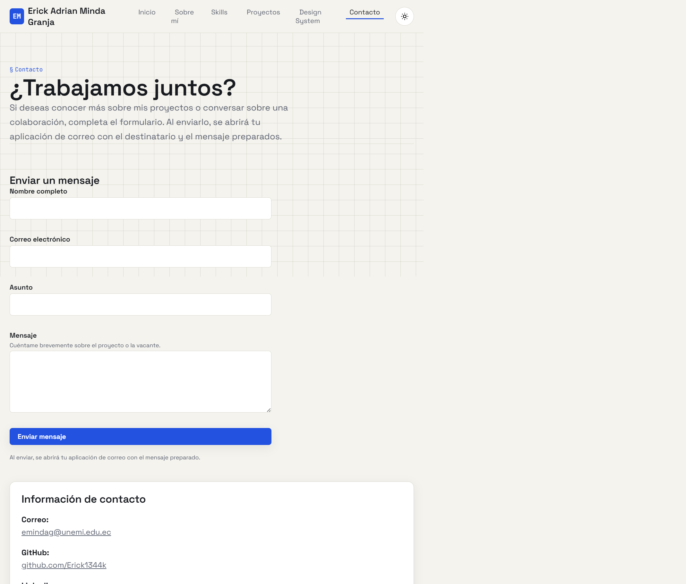

# Portafolio de Erick Adrian Minda Granja

Portafolio personal para presentar mi perfil como estudiante de Ingeniería en Software, mis habilidades, proyectos académicos y formas de contacto.

## Secciones

- Inicio: presentación y tecnologías principales.
- Sobre mí: perfil, formación e intereses.
- Skills: habilidades organizadas por categoría.
- Proyectos: proyectos destacados con filtros por área.
- Design System: colores, tipografía, espaciado y componentes.
- Contacto: formulario con validación y envío mediante la aplicación de correo del visitante.

## Tecnologías

- HTML5 semántico.
- CSS3 adaptable, con tema claro/oscuro.
- JavaScript para navegación móvil, tema persistente, filtros y validación.
- Google Fonts: Space Grotesk y JetBrains Mono.

No requiere compilación ni instalación de dependencias.

## Cómo visualizarlo

Abre `index.html` directamente en un navegador. También puedes abrir la carpeta en Visual Studio Code y servir `index.html` con una extensión como Live Server. Para cargar las fuentes de Google se necesita conexión a Internet.

## Capturas

Las imágenes muestran las páginas completas en escritorio.

### Inicio

### Sobre mí

### Habilidades

### Proyectos

### Design System

### Contacto

